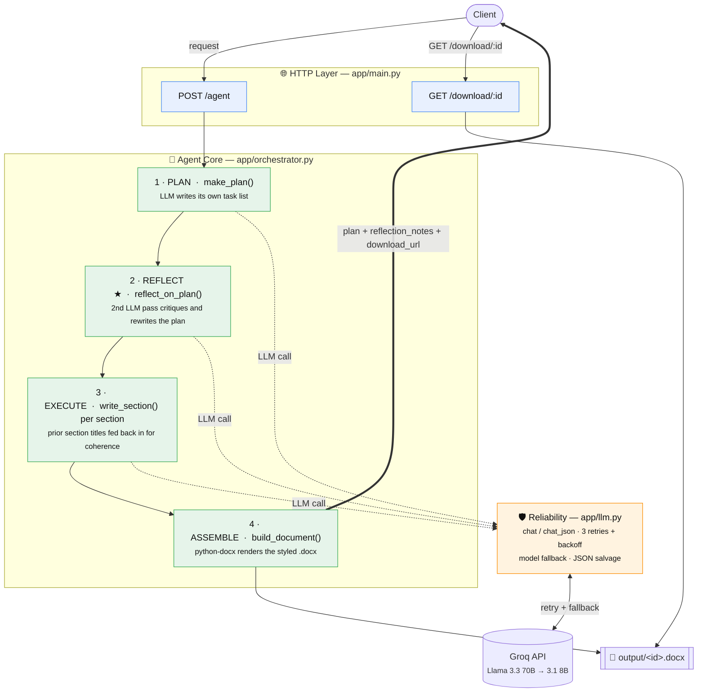

# Autonomous Document Agent

A small autonomous AI agent that takes a natural-language request, **plans its own
task list**, **reflects on and improves that plan**, executes each step with an LLM,
and produces a polished **Microsoft Word (.docx)** business document.

Built for the *Python AI Engineer – Autonomous Agents – 60-Minute Build Challenge*.

[](https://share.streamlit.io/)
&nbsp;·&nbsp; **Two ways to run it:** a live **Streamlit web app** where you *watch the
agent think*, or a **FastAPI** JSON endpoint.

> ▶ **Try it live:** _add your Streamlit Community Cloud URL here after deploying
> (takes ~2 minutes — see [Deploy](#deploy-free-on-streamlit-community-cloud))._

---

## What it does

`POST /agent` with `{"request": "..."}` and the agent:

1. **Plans** — the LLM decides the document type, title, audience, assumptions,
   and an ordered list of sections (its own TODO list).
2. **Reflects (self-check)** — a second LLM pass critiques the plan and returns an
   improved one. *This is the mandatory engineering improvement (see below).*
3. **Executes** — writes each section in order, feeding earlier sections back in as
   context so the document stays coherent.
4. **Assembles** — renders everything into a styled `.docx` with headings, bullets,
   and tables via `python-docx`.

It returns JSON (the plan + a download link) and serves the file at
`GET /download/{id}`.

---

## Architecture

The system is a thin **HTTP layer** over an **agent core** that reasons in four
stages, backed by a **reliability layer** that every model call passes through.
Layers only depend downward, and the LLM's output is validated against typed
contracts before it's ever trusted.



> ★ = the mandatory *"one real engineering improvement"* (the reflection pass — see below).
> **Solid arrows** = control/data flow · **dotted** = every model call funnels through the reliability layer.

**Request lifecycle:** `POST /agent` → validate body (`AgentRequest`) → `run_agent`
runs PLAN → REFLECT → EXECUTE → ASSEMBLE → response carries the final `Plan`,
`reflection_notes`, and a `download_url`. A follow-up `GET /download/{id}` streams
the `.docx` from `output/`.

### Design principles

- **The LLM plans; the code enforces.** The agent decides *what* the document is,
  but every plan is parsed into Pydantic models (`Plan`, `PlanStep`) — malformed
  output is rejected, not silently executed.
- **Fail soft, never crash.** Reflection degrades to the original plan on error;
  `llm.py` retries and falls back before giving up; `/agent` returns a clean 500
  instead of leaking a stack trace.
- **One direction of dependency.** HTTP → core → reliability. `docgen` and
  `schemas` are leaf modules with no upward imports, so each layer is testable in
  isolation (`demo.py` exercises the core with no server).

### Modules

| File | Layer | Responsibility |
|------|-------|----------------|
| `app/main.py` | HTTP | FastAPI endpoints: `POST /agent`, `GET /download/{id}`, `GET /health`, `/` → docs |
| `app/orchestrator.py` | Core | The agent loop: plan → reflect → execute → assemble |
| `app/schemas.py` | Core | Pydantic contracts — validates the LLM's plan, not just trusts it |
| `app/llm.py` | Reliability | Groq client with retry + model fallback + JSON salvage |
| `app/docgen.py` | Output | `python-docx` rendering (headings, bullets, numbered lists, tables, inline Markdown) |
| `streamlit_app.py` | UI | Streamlit front-end that streams the agent's plan → reflect → write live |
| `demo.py` | — | Runs both required test cases against the core, no server needed |

Both the Streamlit UI and the FastAPI endpoint call the **same** streaming core
(`orchestrator.run_agent_events`) — the UI just renders each event as it arrives.

**Tech:** Python · Streamlit · FastAPI · Groq (Llama 3.3 70B primary / 3.1 8B fallback, free tier) · python-docx · Pydantic.

---

## The mandatory engineering improvement: Reflection / self-check

**What:** After the agent writes its first plan, a second LLM pass reviews that plan
against the original request — checking completeness, section ordering, appropriate
document type, and whether ambiguous requests were handled with sensible
assumptions — then returns a revised plan (`orchestrator.reflect_on_plan`).

**Why I chose it:** The single biggest failure mode of a naive "one-shot" agent is
committing to a bad first plan and dutifully executing it. Reflection is the cheapest,
highest-leverage way to make the agent genuinely *decide* rather than just *react* —
which is exactly what "autonomous decision-making" in the brief is asking for.

**How it improves the agent:** In testing, the reflection pass reliably adds missing
sections (e.g. inserting a *Budget & Resource Allocation* section into a project
plan), reorders sections for logical flow, and makes assumptions explicit for
under-specified requests. The `reflection_notes` field in the response shows exactly
what changed on each run, so the behaviour is observable, not a black box.

**Supporting robustness:** `llm.py` also implements **retry + model fallback**
(primary → smaller fallback model, with exponential backoff) so transient API errors
degrade gracefully instead of failing the request. Reflection itself is wrapped in a
try/except that falls back to the original plan if the self-check ever fails.

---

## Setup & run

```bash
# 1. Create a virtual environment (Python 3.12 recommended)
py -3.12 -m venv .venv
.venv\Scripts\activate            # Windows
# source .venv/bin/activate       # macOS/Linux

# 2. Install dependencies
pip install -r requirements.txt

# 3. Add your free Groq key
copy .env.example .env            # then edit .env and paste your key
# get one at https://console.groq.com/keys
```

### Run the web app (recommended) 🌟

```bash
streamlit run streamlit_app.py
```

Opens at **http://localhost:8501**. Type a request (or click an example), hit
**Generate**, and watch the agent plan, critique its own plan with a visible
before/after diff, write each section live, then hand you a **Download .docx**
button. This is the version to screen-record for a demo.

### Run the two required test cases (no server needed)

```bash
python demo.py
```

Generates two documents in `output/` and prints each agent-generated task list.

### Run the API

```bash
uvicorn app.main:app --reload --port 8000
```

Then:

```bash
# Standard request
curl -X POST http://127.0.0.1:8000/agent \
  -H "Content-Type: application/json" \
  -d "{\"request\": \"Create a project plan for launching a mobile banking app.\"}"

# Download the generated document (id comes from the response)
curl -O -J http://127.0.0.1:8000/download/<document_id>
```

Interactive docs (Swagger UI): open **http://127.0.0.1:8000/docs**.

---

## Deploy free on Streamlit Community Cloud

No Docker, no server config — Streamlit builds straight from this repo.

1. Push this repo to GitHub (already done if you're reading this there).
2. Go to **[share.streamlit.io](https://share.streamlit.io/)** → **New app** → pick
   this repo, branch `main`, main file **`streamlit_app.py`**.
3. Open **Advanced settings → Secrets** and paste:
   ```toml
   GROQ_API_KEY = "gsk_your_key_here"
   ```
4. Click **Deploy**. You get a public `https://<your-app>.streamlit.app` URL in
   ~2 minutes — drop it into the "Try it live" link at the top of this README.

The app bridges Streamlit secrets into the environment at startup, so the exact
same code runs locally (via `.env`) and in the cloud (via Secrets). See
`.streamlit/secrets.toml.example` for the full list of keys.

---

## The two test inputs

| # | Type | Request |
|---|------|---------|
| 1 | **Standard** | *"Create a project plan for launching a mobile banking app for a mid-sized credit union, including timeline, milestones, team roles, and risks."* |
| 2 | **Complex / ambiguous** | *"We need a document for the new thing we discussed — make it work for leadership. Something about improving how the team handles support tickets. Not sure on budget or timeline."* |

Test 2 is intentionally vague: no clear document type, no budget, no timeline. The
agent has to infer that leadership wants a **proposal**, invent a sensible structure,
and record its assumptions explicitly — demonstrating autonomous decision-making.

---

## Talking points for the video

- **Live demo (3–4 min):** run `demo.py`, show both task lists print, then open both
  `.docx` files. Then start the server and show `POST /agent` + `/download` in
  `/docs`.
- **What you built (2–3 min):** walk the architecture diagram above — FastAPI surface,
  the plan→reflect→execute→assemble loop, Groq integration, python-docx generation.
- **Debugging insight (1–2 min):** e.g. the LLM occasionally wrapped its JSON plan in
  prose/markdown fences; fixed by using Groq's JSON mode **and** a salvage parser in
  `chat_json` that extracts the object between the first `{` and last `}`.
- **Tradeoff (1–2 min):** *Autonomous planning vs deterministic workflows.* Letting
  the LLM design the document structure makes the agent flexible across any request
  type, at the cost of some determinism — mitigated by validating the plan with
  Pydantic and adding the reflection pass to catch weak plans before execution.
